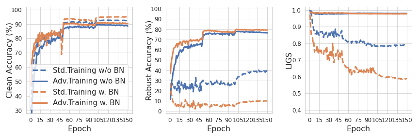
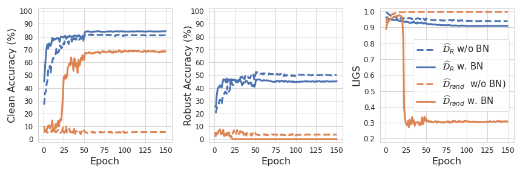
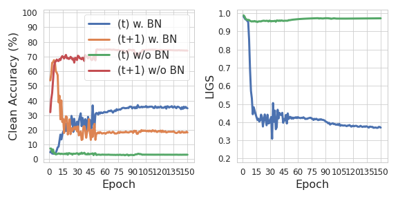

# Batch Normalization Increases Adversarial Vulnerability and Decreases Adversarial Transferability: A Non-Robust Feature Perspective [ICCV](https://openaccess.thecvf.com/content/ICCV2021/html/Benz_Batch_Normalization_Increases_Adversarial_Vulnerability_and_Decreases_Adversarial_Transferability_A_ICCV_2021_paper.html) [ArXiv](https://arxiv.org/abs/2010.03316)

## Abstract
Batch normalization (BN) has been widely used in modern deep neural networks (DNNs) due to improved convergence. BN is observed to increase the model accuracy while at the cost of adversarial robustness. There is an increasing interest in the ML community to understand the impact of BN on DNNs, especially related to the model robustness. This work attempts to understand the impact of BN on DNNs from a non-robust feature perspective. Straightforwardly, the improved accuracy can be attributed to the better utilization of useful features. It remains unclear whether BN mainly favors learning robust features (RFs) or non-robust features (NRFs). Our work presents empirical evidence that supports that BN shifts a model towards being more dependent on NRFs. To facilitate the analysis of such a feature robustness shift, we propose a framework for disentangling robust usefulness into robustness and usefulness. Extensive analysis under the proposed framework yields valuable insight on the DNN behavior regarding robustness, e.g. DNNs first mainly learn RFs and then NRFs. The insight that RFs transfer better than NRFs, further inspires simple techniques to strengthen transfer-based black-box attacks.

## Clean accuracy, robust accuracy & LIGS
### ResNet18 with & without BN
To reproduce the plots in Figure 3 in the paper, first train the ResNet18 architecture with and w/o BN and record the statistics with `bash ./bn_increases_adversarial_vulnerability/train_models.sh`. Afterward, run the jupyter notebook `plot.ipynb` until the third cell, which produces the following plot: 



### ResNet18 on D robust and D rand
To reproduce the plots in Figure 4 in the paper, train the ResNet18 architecrtures on the `D robust` and `D rand` datsets with `bash ./bn_increases_adversarial_vulnerability/tain_grad_image_datasets.sh` Afterward, run the jupyter notebook `plot.ipynb` until the fourth cell, which produces the following plot: 



### Dataset with conflicting features
To reproduce the plots in Figure 6, first extract the dataset of the conflicting features with `bash extract_conflicting_feature_datset.sh`. Once the dataset is extracted, train the ResNet18 networks on it with `bash train_conflicting_feature_dataset.sh`. Afterward, run the fifth cell of the jupyter notebook `plot.ipynb`, which produces the following plot:



## Citation
```
@InProceedings{Benz_2021_ICCV,
    author    = {Benz, Philipp and Zhang, Chaoning and Kweon, In So},
    title     = {Batch Normalization Increases Adversarial Vulnerability and Decreases Adversarial Transferability: A Non-Robust Feature Perspective},
    booktitle = {Proceedings of the IEEE/CVF International Conference on Computer Vision (ICCV)},
    month     = {October},
    year      = {2021},
    pages     = {7818-7827}
}
```